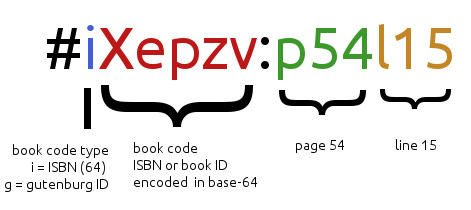
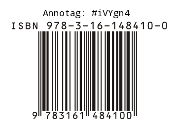

The major currently available textual annotation systems---CommentPress, Annotation Studio, and Annotator.js, to name a few---suffer from centralized approaches to the storage and retrieval of annotations. The disadvantages of these approaches parallel those of the much-discussed "data silos." Users of those systems that wish to comment on an electronic text must entrust those comments with the website that hosts the annotation software. Should that website go down, or should the user lose his or her institutional subscription, all of that user's annotations are lost. What is needed is a rhizomatic annotation protocol whose data storage paradigm doesn't depend on a single institution, and which can be disseminated across the Internet and across well-established social media infrastructures. 

Annotags is a protocol that has been designed for this purpose. It is a way to encode bibliographic and textual location information in a string of numbers and letters that are human-readable, easily typeable, and short enough for use as a hashtag on microblogging platforms such as Twitter. The scope of the annotation can be easily controlled by adding human-readable location markers. The annotag for Moretti's _Graphs, Maps, and Trees_, for instance, is `#iMeASm`, and the annotag for page 19 of the same book is `#iMeASm:p19`. 

The anatomy of an annotag is simple. Figure 1 illustrates another example, the annotag `#iXepzv:p54l15`. The first letter here, `i`, denotes the type of bibliographic code that will follow. In this case, it is an ISBN, shortened by encoding it into base-64 with the help of a simple program created for this purpose. In other cases, it could be an OCLC control number, Project Gutenburg etext ID, or Google Books ID. Book code types include, but are by no means limited to the following: 

 * `I` = Raw ISBN, ex. I0393911535
 * `i` = Base 64-encoded ISBN, ex. iXepzv
 * `G` = Raw Project Gutenberg book ID, ex. G105
 * `g` = Base 64-encoded Gutenberg book ID, ex. gBp
 * `B` = Google Books ID
 * `O` = Raw OCLC Number, ex. O29877721. 
 * `o` = Base 64-encoded OCLC number, ex. oBxXZ

The following letters and numbers of the annotag are the bibliographic code, followed by a colon used as a separator. Since many social media outlets like Twitter don't recognize special characters like colons as part of a hashtag, this separator has the feature of automatically allowing for two levels of aggregation: a researcher may wish to aggregate tweets or blog posts that annotate on the level of the entire text, or to aggregate on the level of the more specific text location. Twitter already allows for the former, and a browser plugin is currently being planned which will allow for the latter. 

The final characters of the annotag represent the location of the text being annotated. Many types of location abbreviations are available in the full spec for this protocol. Among them: 

 * `p` = page, ex. p54 is page 54. 
 * `d` = part (“division”), ex. d2c5 is Part II, Chapter 5. 
 * `b` = book, ex. b3c7 is Book III, Chapter 7. 
 * `c` = chapter, ex. c34 or cXXXIV is Chapter 34. 
 * `a` = act, ex. a1 is Act I. To be used for drama. 
 * `s` = scene, ex. a1s3 is Act I, Scene 3. 
 * `P` = paragraph or stanza, ex. c5P2 is the second paragraph of Chapter 5. 
 * `l` = line number, ex. p76l20 is page 76, line 20. 
 * `w` = word number, ex. p82l10w4 is the fourth word of the tenth line on page 82. 

The semantic nature of this textual location protocol is such that it is not only easily human-readable, but that it often provides a more accurate way to virtually "select" a portion of text than the method that relies on UI text selection, in which text is selected by the character. Using the marker `P`, paragraphs in etexts can be easily selected for annotation. The forthcoming browser plugin will automatically assign paragraph numbers to etexts publicly available at Project Gutenberg and elsewhere, allowing the user to see at a glance which annotags would be available for which paragraphs. In the meantime, books that are organized into parts and chapters are easily annotated on the paragraph level with a location abbreviation like `c3P2` for chapter 3, paragraph 2. 

The applications of this protocol are many and wide-ranging. Publishers can add annotags to the back covers of their print books or ebooks (see the mockup in Figure 2). Professors can assign annotag-based commenting to their students as micro-responses to course readings, with any level of granularity. Scholars can use annotags as bibliographic shorthand while composing papers. 

Annotags is a completely free and open-source protocol, and all of its related software is released under the GPLv3. The project welcomes contributors of all types, whether as developers, designers, or early adopters. 
